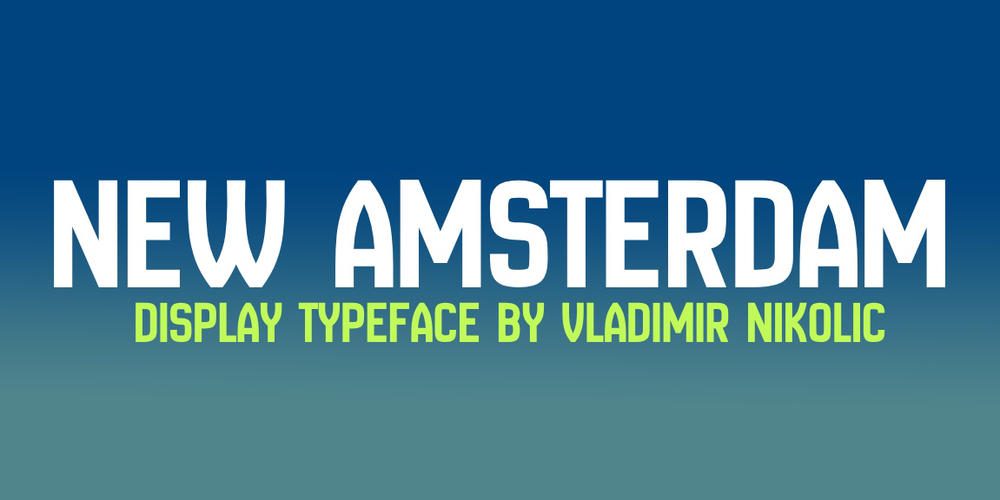

# New Amsterdam font

New Amsterdam was a 17th-century Dutch settlement established at the southern tip of Manhattan Island
that served as the seat of the colonial government in New Netherland. 

## Variable Font Axe

New Amsterdam has the following axe:

Axis | Tag | Default | Static Instances
--- | --- | --- | ---
Weight | wght | 400 | Regular

## License

This Font Software is licensed under the SIL Open Font License, Version 1.1.
This license is available with a FAQ at [https://openfontlicense.org](https://openfontlicense.org)
